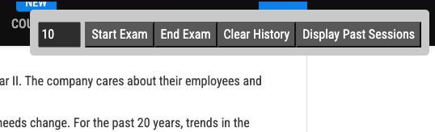

# ExamTopics-Enhancer

## Description

This is a [tampermonkey](https://www.tampermonkey.net/) script that enhances the [examtopics.com](https://www.examtopics.com/) website by adding a control panel to the top of the page and adding a score counter to the top right of the page and allows a user to create a more exam like experience on the examtopics website.

## Features

- Add a control panel to the top of the page to control enhancements
- Start an "exam" by inputting the number of questions you want to answer and randomising the order of the questions
- Allow users to select answers with a radio button selection
- Allow users to submit answers and mark the card green or red depending on whether the answer is correct or not
- Record previous answers and display them in a popup window from the control panel

### Example Images

The control panel is inserted at the top of the page

A score counter is inserted at the bottom right of the page

The question card is modified to allow users to select answers with radio buttons and submit answers as you can see in the image below

## Installation

- Install [tampermonkey](https://www.tampermonkey.net/)
- Add the [script](./tampermonkey-examtopics.js) to tampermonkey
- If you have a premium account you're good to go, if not we'll need to do a little more work
- Download each page of questions of the exam you want to take as HTML and save them in a folder **make a note of this**
- Use the [html-joiner.py](./html-joiner.py) script to join all the pages together into one html file
  - Note: There is a config section in the header of this file, update the variables
    - `folder_path` is the path to the folder containing the html files
    - `first_page_pattern` is the pattern of the first page of the exam, this is used to find the first page of the exam and insert the rest of the pages and questions after it
    - `output_file` is the name of the combined html file that will be output **make a note of the path to this file**
- Open the combined html file in a browser, you should see the exam with all the questions
- Return to the tampermonkey script and add another `@include` line to the top of the file with the path to the combined html file that you just created and save the updated script
  - Example: `@include file:///Users/richard.weston/git/riweston/ExamTopicsQuizMaker/res/combined_page.html`
- Finally, make sure tampermonkey has access to file urls
  - Click the tampermonkey icon in the browser
  - Click the settings icon
  - Click the "Security" tab
  - Make sure "Allow access to file URLs" is checked
    - Example: 
- You should now be able to open the combined html file in a browser and the script should run
